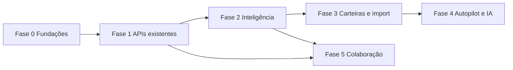

# Roadmap ambicioso — Dashboard (front + back)

- **Status:** ideia
- **Área:** outro (várias)
- **Prioridade:** alta
- **Data:** 2026-08-05
- **Autor:** produto / engineering

## Problema

O ciclo “planejei → paguei → entendi” da dashboard já está bem coberto (inbox, assentos rápidos, orçamento, MoM, export, calendário, fechamento, planejador). O salto seguinte não é só polir telas: é **trazer para o web o que o back/mobile já sabem**, e criar **capacidade estrutural** (regras, contas, previsão, colaboração) que o domínio ainda não tem.

## Proposta

Roadmap em **5 fases**. Cada item abaixo pode virar um plano próprio (`docs/features/YYYY-MM-DD-slug.md`) antes de entrar em execução. Preferir features que:

1. Reaproveitam API já existente (menor risco), ou  
2. Desbloqueiam várias telas quando o back nasce (maior alavancagem).

## Já existe (não reinventar)

**Web:** início, extrato, relatórios, insights, notificações, fechamento, dívidas, a pagar, calendário, planejador, simulador, planilha, pra pagar, previstos, caixinhas, fixas, orçamento, categorias, perfil, interno.

**Back maduro e subusado no web:** `credit-card`, `joint-account`, `grocery*` / `pantry`, `/details/projection`, `financial-score`, `emergency-reserve`.

**Backlog antigo** (`2026-08-05-backlog-ideias-dashboard.md`): itens 1–7, 10 e 12 estão **feitos**; restam regras de categoria, multi-conta e família light — incorporados e ampliados aqui.

---

## Norte (produto)

Uma dashboard onde o usuário, em poucos minutos por semana:

- vê **todo o dinheiro** (contas + cartões + conjunto),
- sabe **o que vence e o que estoura** sem caçar tela,
- **corrige categorização** sem esforço,
- olha **3–12 meses à frente**,
- e, se quiser, **divide a casa** sem perder o controle.

---

## Fase 0 — Fundações (1–2 semanas)

Objetivo: desbloquear velocidade de features ambiciosas.

| # | Feature | Front | Back | Prioridade |
|---|---------|-------|------|------------|
| 0.1 | **Client API tipado + camada de features flags** | `lib/finance-api` unificado, feature flags locais/env | Opcional: `GET /user/preferences` | alta |
| 0.2 | **Hub “Mais” / nav por domínio** | Reorganizar sidebar (Operação / Cartões / Casa / Inteligência) | — | média |
| 0.3 | **Projeção anual no web** | Card/página usando `GET /details/projection` | Já existe | alta |

**Critério de saída da fase:** projeção anual visível no início ou em `/relatorios`; mapa de rotas futuras documentado.

---

## Fase 1 — Destravar o back que já existe (~4–6 semanas)

Objetivo: paridade útil com o app nos módulos que já têm API.

### 1.1 Cartões de crédito na dashboard (alta)

- **Problema:** compra no cartão some do fluxo da web; fatura e limite só no mobile.  
- **Proposta:** `/cartoes`, detalhe da fatura do mês, compras, pagar fatura → baixa saldo / gera lançamento.  
- **Front:** lista, fatura, compra rápida, risco/limite.  
- **Back:** reutilizar `/credit-card/*`; gaps só se faltar endpoint agregador “home do cartão”.  
- **Não inclui:** Open Finance bancário.

### 1.2 Conta conjunta / família light (alta)

- **Problema:** casal/família não compartilha orçamento na web.  
- **Proposta:** `/conjunto` — criar, convidar por e-mail, listar membros, extrato filtrado por `jointAccountId`.  
- **Front:** manage + seletor “Pessoal / Conjunto” no extrato e no início.  
- **Back:** reutilizar `/joint-account`; revisar se reports/details filtram joint (pode precisar de query params).  
- **Não inclui:** permissões por categoria ou múltiplas orgs.

### 1.3 Mercado & despensa (média)

- **Problema:** grocery/pantry só aparecem no cron interno.  
- **Proposta:** `/mercado` leve — listas, última compra, alertas de despensa; atalho no fechamento do mês.  
- **Front:** CRUD básico + insights de preço se a API já entregar.  
- **Back:** reutilizar `/grocery*`, `/pantry`; eventual endpoint “resumo do mês de mercado” se faltar.

### 1.4 Score & reserva como hubs (baixa → média)

- **Problema:** score e reserva estão enterrados em insights/caixinhas.  
- **Proposta:** `/saude` com score + reserva + 3 ações recomendadas; links profundos.  
- **Back:** já existe; opcional histórico de score (`FinancialScoreSnapshot`).

---

## Fase 2 — Inteligência de categorização e fluxo (~4–6 semanas)

### 2.1 Regras de categorização (alta) — **exige back novo**

- **Problema:** muitos lançamentos em “Outros”; retrabalho no extrato.  
- **Proposta:** regras “mensagem contém X → categoria Y”; aplicar no create e em lote.  
- **Front:** `/categorias/regras`, sugestão pós-lançamento, “aplicar às últimas N”.  
- **Back (novo):**
  - Model `CategoryRule` (`userId`, `matchType`, `pattern`, `categoryId`, `priority`, `enabled`)
  - `CRUD /category-rule`
  - Hook em `POST/PATCH /transaction` para auto-aplicar
  - `POST /category-rule/apply-batch`
- **Não inclui:** ML na v1 (só regras explícitas).

### 2.2 Templates de lançamento (média)

- **Problema:** assentos rápidos ainda pedem digitar tudo.  
- **Proposta:** templates (“mercado”, “combustível”) com valor típico e categoria; pin no launcher.  
- **Front:** CRUD leve + integração no `QuickTransactionLauncher`.  
- **Back (novo ou JSON em User preferences):** `TransactionTemplate` ou campo `preferences.templates`.

### 2.3 Previsão de caixa 90 dias (alta)

- **Problema:** sabe o mês; não vê “choque” nas próximas semanas.  
- **Proposta:** timeline de entradas/saídas previstas (fixas + parcelas + previstos + faturas).  
- **Front:** `/previsao` ou seção em calendário/relatórios.  
- **Back:**
  - Preferir agregar o que já existe (`details`, recurring, installments, planned, credit-card statement)
  - Novo se necessário: `GET /cashflow-forecast?days=90` retornando buckets diários/semanais

### 2.4 Alertas acionáveis (média)

- **Problema:** inbox é calculada; não há preferências (“avise 3 dias antes”).  
- **Proposta:** preferências de alerta na web + marca “ignorado até data”.  
- **Back (novo):** `NotificationPreference` + `InboxDismissal` (ou campo em reminder); crons já existem — só parametrizar.

---

## Fase 3 — Multi-carteira e Open Finance lite (~6–10 semanas)

### 3.1 Contas / carteiras manuais (alta) — **exige back novo**

- **Problema:** um único `User.amount` mistura realidade.  
- **Proposta:** contas manuais (corrente, poupança, dinheiro, investimento); lançamentos com `walletId`; início consolidado + por conta.  
- **Front:** `/contas`, seletor no extrato/assento rápido, cards no início.  
- **Back (novo):**
  - Model `Wallet` (`name`, `type`, `initialBalance`, `color`, `archivedAt`)
  - `Transaction.walletId` (migration + default wallet por usuário)
  - Migrar `User.amount` → saldo derivado da wallet default **ou** manter sync controlado
  - `GET /wallet`, `GET /wallet/balances`
- **Não inclui:** sync bancário automático nesta fase.

### 3.2 Transferências entre contas (média)

- **Problema:** sacar da corrente pra poupança hoje vira 2 lançamentos manuais inconsistentes.  
- **Proposta:** tipo `TRANSFER` (ou par credit/debit linkado).  
- **Back:** `Transfer` / `linkedTransactionId`; não contar transfer como despesa nos reports.

### 3.3 Open Finance / importação (baixa → ambicioso)

- **Problema:** digitação ainda é o gargalo.  
- **Proposta em degraus:**
  1. **CSV/OFX import** (alto ROI, sem parceiro)
  2. **Pluggy / Belvo / equivalente** (Open Finance BR) — contas + cartões read-only
- **Front:** wizard de importação + reconciliação com extrato.  
- **Back:** `ImportJob`, `ExternalConnection`, mapeamento de categoria; webhooks.  
- **Risco:** compliance, custo do provider, UX de reconciliação.

---

## Fase 4 — Autopilot e IA (~trimestre+)

### 4.1 Assistente “o que fazer agora?” (média)

- **Problema:** muitas telas boas, pouca recomendação.  
- **Proposta:** card diário com 1–3 ações (pagar X, cortar Y, reforçar caixinha Z) baseado em score + atrasados + budget.  
- **Back:** endpoint `GET /coach/today` (determinístico primeiro; LLM opcional depois).

### 4.2 OCR de notas / captura de comprovante (baixa → média)

- **Problema:** lançar compra do mercado é chato.  
- **Proposta:** upload de foto → rascunho de lançamento (valor, data, merchant).  
- **Back:** integração OCR (Vision / Textract / provider BR); `ReceiptDraft`.  
- **Front:** fluxo no assento rápido.

### 4.3 Simulação de cenários “e se?” (média)

- **Problema:** planejador e simulador são isolados.  
- **Proposta:** sandbox: “aumentar pagamento em R$ X”, “adiar compra Y”, ver impacto em meses e sobra.  
- **Back:** `POST /scenario/simulate` reutilizando debt-planner + cashflow-forecast.

### 4.4 Copiloto com LLM (ambicioso)

- **Problema:** relatórios não contam história.  
- **Proposta:** “Explique meu mês” / “Por que a sobra caiu?” com dados já agregados (nunca raw sensível sem redaction).  
- **Back:** `POST /ai/month-summary` com payload estruturado + rate limit.  
- **Guardrails:** opt-in, sem treino em dados do user, auditoria.

---

## Fase 5 — Colaboração e multi-dispositivo (~em paralelo após 1.2)

### 5.1 Papéis na conta conjunta (média)

- OWNER / MEMBER já existem; expor na UI: convidar, remover, sair, visualizar só conjunto vs tudo.

### 5.2 Metas compartilhadas (média)

- Caixinha/`FuturePurchase` com `jointAccountId` (se ainda não houver); contribuidores veem progresso.

### 5.3 Atividade recente da casa (baixa)

- Feed “Fulano pagou energia”, “Beltrano marcou lembrete” — exige `ActivityEvent` no back.

---

## Ordem sugerida de ataque (ambiciosa, mas realista)

1. **0.3** Projeção anual no web (ganho rápido, API pronta)  
2. **1.1** Cartões de crédito na dashboard ✅ (web entregue; push local)  
3. **1.2** Conta conjunta na web  
4. **2.1** Regras de categorização (primeiro grande domínio novo)  
5. **2.3** Previsão de caixa 90 dias  
6. **3.1** Multi-carteira manual  
7. **3.3.1** Import CSV/OFX  
8. **4.1** Coach diário  
9. Demais itens conforme tração (mercado, OCR, Open Finance, LLM)

---

## Matriz rápida (impacto × esforço)

| Feature | Impacto | Esforço | Fase |
|---------|---------|---------|------|
| Projeção anual na UI | Alto | Baixo | 0 |
| Cartões web | Alto | Médio | 1 |
| Conta conjunta web | Alto | Médio | 1 |
| Regras de categoria | Alto | Médio–Alto | 2 |
| Previsão 90 dias | Alto | Médio | 2 |
| Multi-carteira | Muito alto | Alto | 3 |
| Import CSV/OFX | Alto | Médio | 3 |
| Open Finance provider | Muito alto | Muito alto | 3 |
| Coach determinístico | Médio–Alto | Baixo–Médio | 4 |
| OCR / LLM | Médio–Alto | Alto | 4 |
| Mercado/despensa web | Médio | Médio | 1 |
| Templates de lançamento | Médio | Baixo | 2 |

---

## Critérios para promover um item a plano executável

- [ ] Problema claro e recorrente  
- [ ] Cabe em 1–3 PRs (ou quebra explícita em épicos)  
- [ ] API cobre 70%+ **ou** migration/contrato back descritos  
- [ ] Não duplica tela já existente  
- [ ] Critérios de pronto + risco (dados, auth, joint, saldo) escritos  
- [ ] Decisão mobile: só web / paridade depois / ambos juntos

## Notas / riscos

- **Saldo único (`User.amount`)** é o maior atrito arquitetural para carteiras e cartões; multi-wallet precisa de desenho de migração cuidadoso.  
- **Joint + reports:** garantir que médias e sobras não misturem ledgers sem filtro.  
- **Open Finance / OCR / LLM:** custo, LGPD e UX de erro pesam mais que o “demo feliz”.  
- App mobile fica fora da entrega default, mas features que nascem no back devem manter contrato compatível com o app.  
- Prioridades são sugestão; validar com uso real (atrasados, “Outros”, dor de cartão vs dor de casal).

## Próximo passo recomendado

Planos do próximo ciclo já abertos:

1. [Projeção anual na dashboard](./2026-08-05-projecao-anual-dashboard.md)  
2. [Cartões de crédito na dashboard](./2026-08-05-cartoes-credito-web.md)  
3. [Regras de categorização](./2026-08-05-regras-categorizacao.md)

Ordem de execução sugerida: **projeção → cartões → regras**.
